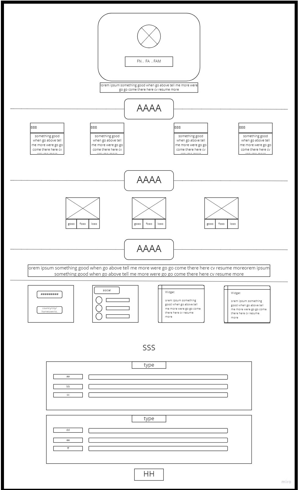

# Project 1 : portfolio 

Hi,My name is **Anas** , and this is my first Project in web developing 

Down here I will sort some info about The project

## Breif

The project is a portfolio page represent my Personal Curriculum Vita

## Sections

the page is devided as below :

* Header :- contains a picture , Name ,Job title and small paragraph about me.
* Education :- The Academic paths I have studied over the years.
* Projects :- quick view for my previous Projects (fake data).
* Experience :- all the skills and knowldge I gained from my work Journey
* Footer :- contact info plus some quotes that I like .

## Design 

I used HTMl & CSS including Bootstrap, flex and UI for creating the WebPage.

The page is Designed according to the wireframe and Mockup style, wich are confirmed previously.

* A picture of the Wireframe 

* A picture of the Mockup

 

[substiute_mockup](https://miro.com/app/board/uXjVOGDcx18=/?invite_link_id=895536890613)

## Additions
A job tracking form added to the skills page

* Picture of the Form Wireframe & Mockup

## Project links

* Project repo link
[Ropo](https://github.com/10-anasAllawafeh/project1)

* Project Live Link 
[Live](https://10-anasallawafeh.github.io/project1/)

## Contact Info

here are some of my social links:
* [Linked In](https://www.linkedin.com/in/anas-al-lawafia-b05954232)
* [Git Hub](https://github.com/10-anasAllawafeh)
* E-mail: anasq0q@gmail.com
* Discord UserName: 10- Anas Allawafeh#2604

*And That's It !!! don't hesitate to contact me for more info :)*
